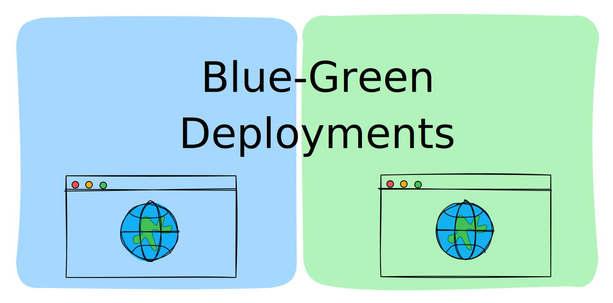
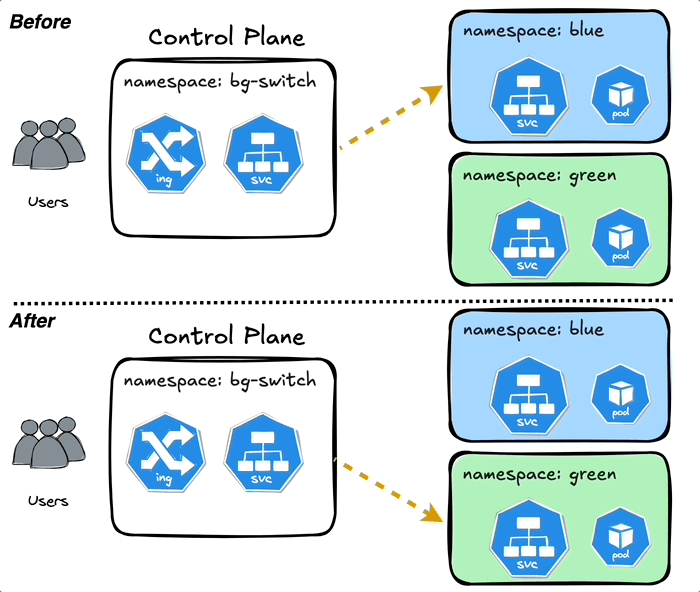

# Blue Green Deployments using Kubernetes Namespaces



## Quickstart
1. Create Namespaces
```bash
kubectl create ns nginx-blue
kubectl create ns nginx-green
kubectl create ns bg-switch
```
2. Setup your `/etc/hosts` to point to the custom URL within `ingress.yaml`
3. Install the manifests
```bash
```bash
kubectl apply -f ingress.yaml -n bg-switch
kubectl apply -f service-switch -n bg-switch
kubectl apply -f blue-app.yaml -n nginx-blue
kubectl apply -f green-app.yaml -n nginx-green
```
4. Switch between blue and green using `patch`.
```bash
kubectl patch service bg-switch-service -n bg-switch --type=merge -p '{"spec":{"externalName":"nginx-green-svc.nginx-green.svc.cluster.local"}}'
```